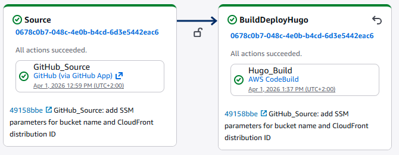
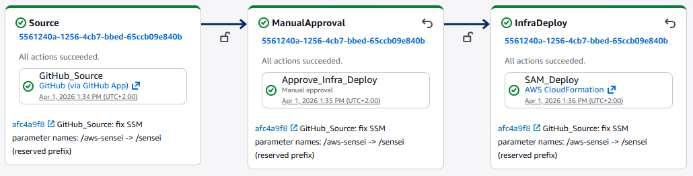
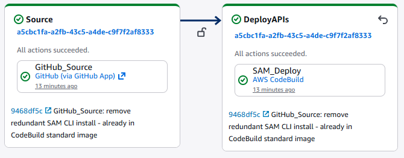

In the [first post](/posts/2026-03-26-aws-cloud-migration-blog/) I described how aws-sensei.cloud is set up — Hugo, S3, CloudFront, a CodeBuild pipeline. That was a good start. But one pipeline for everything doesn't scale.

The problem showed up in practice faster than expected: with a single pipeline, I kept hitting the CodeBuild free tier limit just by writing blog posts — even though I had only changed Markdown. Every commit triggered the full pipeline: Hugo build, infrastructure deploy, everything. Neither efficient nor cost-friendly.

On top of that comes the logical separation: a typo in a blog post shouldn't redeploy the infrastructure. A Lambda change shouldn't trigger the Hugo build. The more components you add, the more important a clean separation becomes.

## The New Repo Structure

Everything lives in one repository — but cleanly divided:

```text
Blog/
├── frontend/          ← Hugo blog (HTML, Markdown, theme)
│   └── buildspec.yml
├── apis/              ← Lambda functions (coming soon)
│   └── buildspec.yml
├── infra/             ← CloudFormation templates
│   └── infrastructure.yaml
└── shared/            ← Shared utilities (e.g. Lambda layers)
```

Three folders, three responsibilities, three pipelines — each triggers only when its folder changes.

## CodePipeline V2 with Path Filters

This was the key step. CodePipeline V2 supports native path filters directly in CloudFormation:

```yaml
AWSSenseiBlogPipeline:
  Type: AWS::CodePipeline::Pipeline
  Properties:
    PipelineType: V2
    Triggers:
      - ProviderType: CodeStarSourceConnection
        GitConfiguration:
          SourceActionName: GitHub_Source
          Push:
            - FilePaths:
                Includes:
                  - frontend/**
```

V1 didn't have this capability. The workaround would have been a CodeBuild step at the beginning of each pipeline checking via `git diff` whether the relevant folder had changed — and aborting early if not. V2 makes that unnecessary.

## Pipeline 1 — Frontend



```text
GitHub (frontend/**) → Hugo Build → S3 Sync → CloudFront Invalidate
```

The Hugo build runs in CodeBuild using `frontend/buildspec.yml`. The environment variables `WEBSITE_BUCKET` and `CLOUDFRONT_DISTRIBUTION_ID` no longer come from the pipeline itself — they are read at runtime from **SSM Parameter Store**:

```yaml
EnvironmentVariables:
  - Name: WEBSITE_BUCKET
    Type: PARAMETER_STORE
    Value: /sensei/blog/bucket-name
  - Name: CLOUDFRONT_DISTRIBUTION_ID
    Type: PARAMETER_STORE
    Value: /sensei/blog/cloudfront-distribution-id
```

The parameters themselves are automatically updated by the infrastructure pipeline — more on that below.

One side note: SSM parameter names must not start with `/aws` — that is a namespace reserved by AWS. `/sensei/` works without any issues.

## Pipeline 2 — Infrastructure



```text
GitHub (infra/**) → Manual Approval → CloudFormation Deploy
```

Infrastructure changes are more risky than Lambda code or blog posts. A manual approval step before the deploy provides the necessary control:

```yaml
- Name: ManualApproval
  Actions:
    - Name: Approve_Infra_Deploy
      ActionTypeId:
        Category: Approval
        Owner: AWS
        Provider: Manual
        Version: "1"
```

The CloudFormation template (`infra/infrastructure.yaml`) defines the S3 bucket, CloudFront distribution, Route53 record, and ACM certificate. After each successful deploy, CloudFormation automatically writes the current values to SSM Parameter Store:

```yaml
WebsiteBucketNameParam:
  Type: AWS::SSM::Parameter
  DeletionPolicy: Retain
  Properties:
    Name: /sensei/blog/bucket-name
    Value: !Ref WebsiteBucket
```

This fully decouples the frontend pipeline from the infrastructure pipeline — no hardcoded values, no shared dependencies at deployment time.

## Pipeline 3 — APIs



```text
GitHub (apis/**) → SAM Deploy (all stacks)
```

This pipeline handles all Lambda functions and API Gateways — which will be built in upcoming posts. Each feature gets its own folder with a SAM template:

```text
apis/
├── sentiment/
│   ├── handler.py
│   ├── requirements.txt
│   └── template.yaml
└── buildspec.yml
```

The `buildspec.yml` dynamically iterates over all available templates:

```bash
for template in apis/*/template.yaml; do
  stack_name="sensei-api-$(basename $(dirname $template))"
  sam deploy \
    --template-file $template \
    --stack-name $stack_name \
    --no-fail-on-empty-changeset
done
```

New feature = new folder. The pipeline never needs to be touched.

## The CI/CD Infrastructure Itself

The three pipelines, CodeBuild projects, and IAM roles are themselves defined as CloudFormation — in a separate repository (`AWS-Sensei/Infrastructure`). A `master.yaml` orchestrates everything as nested stacks:

```text
master.yaml
├── foundation/roles.yaml        ← IAM roles
├── foundation/artifacts.yaml    ← S3 artifact bucket
├── build/codebuild.yaml         ← Hugo CodeBuild
├── build/sam-codebuild.yaml     ← SAM CodeBuild
├── pipeline/pipeline.yaml       ← Frontend pipeline
├── pipeline/infra-pipeline.yaml ← Infrastructure pipeline
└── pipeline/apis-pipeline.yaml  ← APIs pipeline
```

Infrastructure as Code down to the last bolt.

## What's Coming Next

The APIs pipeline is ready — it's waiting for its first feature. That will be a **sentiment analysis widget** powered by AWS Comprehend: a text field directly in the blog where visitors type a sentence and see in real time whether it reads as positive, negative, or neutral. Lambda, API Gateway, a bit of JavaScript — and a dedicated blog post about how it's built.

---

**Try it out:** The widget is already live. Type any sentence below and AWS Comprehend will tell you how it reads.


